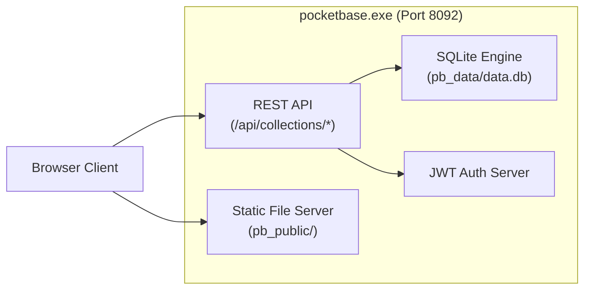
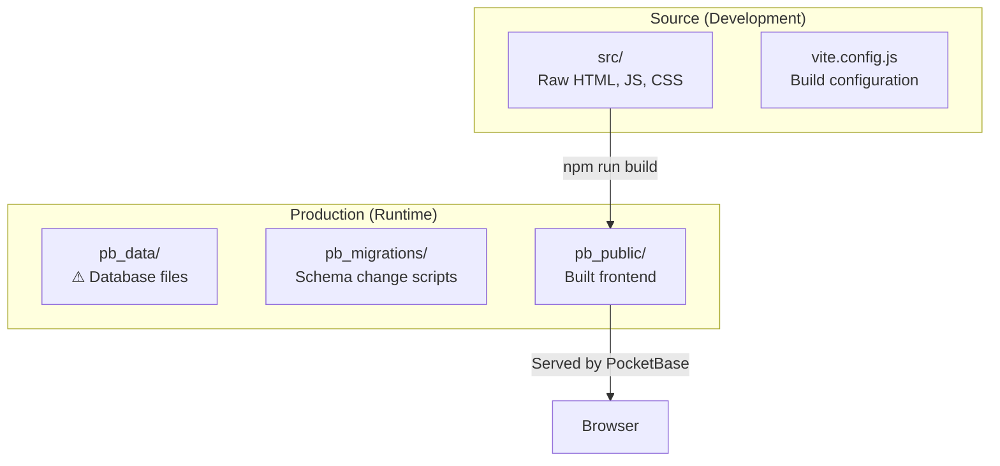
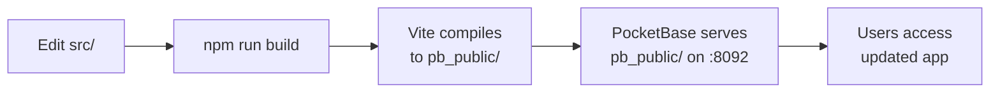

# BC Auto Management — System Architecture & Backend State

> Permanent reference for how the application runs, communicates, and stores data.
> Last updated: 2026-03-17

---

## 1. Core Paradigm: PocketBase as the Engine

The system is powered by `pocketbase.exe` — a single compiled binary that acts as the entire backend:



| Responsibility | Description |
|:---------------|:-----------|
| **Database Engine** | SQLite wrapper storing all records, relations, and settings (`pb_data/data.db`) |
| **REST API Provider** | Auto-generated `/api/` endpoints based on collection schemas |
| **Authentication Server** | JWT token issuance, RBAC, login states (`authService.js:79-92`) |
| **Static File Server** | Serves `pb_public/` on port 8092 — no Apache/Nginx needed |

---

## 2. Directory Structure



### Source Code (`src/`)
Active development directory with raw HTML, CSS, and JS modules. (`vite.config.js:5` — `root: 'src'`)

### Production Directories
- **`pb_data/`**: Contains `data.db` (all records) and `logs.db`. **If deleted, all data is permanently lost.**
- **`pb_migrations/`**: Numbered JS scripts that alter the schema on PocketBase startup.
- **`pb_public/`**: Built frontend (auto-generated by `npm run build`). PocketBase serves this at `http://localhost:8092/`.

---

## 3. Build & Deployment Lifecycle



1. **Development**: Modify files in `src/`.
2. **Compilation**: `npm run build` triggers Vite with `outDir: resolve(__dirname, 'pb_public')`. (`vite.config.js:38`)
3. **Deployment**: Vite writes optimized build directly to `pb_public/`.
4. **Hosting**: `pocketbase.exe` serves `pb_public/` on port 8092. No Node.js needed at runtime.

---

## 4. Background Execution

`BC_AUTO_MANAGEMENT.bat` starts PocketBase as a hidden background process:
```powershell
Start-Process -FilePath ".\pocketbase.exe" -ArgumentList "serve --http=0.0.0.0:8092" -WindowStyle Hidden
```

### Managing the Hidden Process
```powershell
# Stop PocketBase
Stop-Process -Name "pocketbase" -Force

# Or use Task Manager → Details → pocketbase.exe → End Task
```

---

## 5. Docker Deployment

```yaml
# docker-compose.yml (production)
services:
  management:
    build: ./Management
    ports: ["8092:8092"]
    volumes: ["./Management/pb_data:/pb/pb_data"]
    restart: unless-stopped
```

Data persists in `./Management/pb_data/` on the host. Container rebuilds don't affect data. (`docker-compose.yml:20-38`)

---

## 6. System Warnings

> [!CAUTION]
> **Never edit files in `pb_public/`** — they are overwritten by `npm run build`.

> [!WARNING]
> **Port Conflicts**: If the app fails to load, another process may be holding port 8092.
> Check: `netstat -ano | findstr :8092` → `taskkill /PID <PID> /F`

> [!IMPORTANT]
> **Backup**: Copy `pb_data/` to a secure location while the server is stopped. This is the entire application state.
