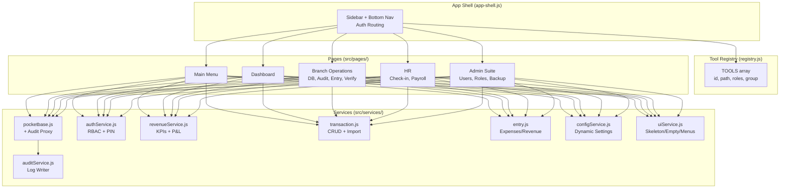
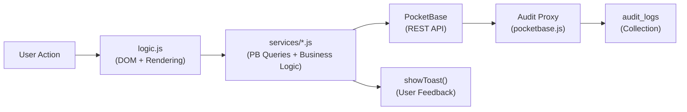

# BC Auto Management — Documentation

> **Last updated**: 2026-03-17 | **Stack**: Vite MPA + PocketBase + Vanilla JS + Chart.js

> [!IMPORTANT]
> **For AI agents**: Read this file AND the [AI Reliability Kit](Docs/) before making changes.
> 
> 1. [Business Rules](Docs/business_rules.md) — Logic governing the system
> 2. [Schema Reference](Docs/schema_reference.md) — Database field details
> 3. [UI Patterns](Docs/ui_patterns.md) — Style & aesthetic guide
> 4. [Verification Protocol](Docs/verification_protocol.md) — Pre-deployment checklist
> 5. [Troubleshooting](Docs/troubleshooting.md) — Resolving build & dev issues

> [!CAUTION]
> **BUILD STEP REQUIRED**: Changes to `src/` are **NOT visible** in production until `npm run build` compiles them into `pb_public/`.
> **HARD REFRESH**: Due to `sw.js` caching, users must `Ctrl+F5` to see updates.
> **NO INLINE SCRIPTS**: Vite strips `<script type="module">` blocks. Always use separate `.js` files.

---

## What Is This?

A management webapp for **BC Auto Xperience** (auto repair business). Handles revenue tracking, expense management, P&L analysis, HR (check-in/payroll), audit logging, and branch operations across 3+ branches in Thailand.

---

## Architecture



### Key Files

| File | Purpose |
|:-----|:--------|
| `src/registry.js` | **Source of truth** — lists ALL tools with id, title, path, roles, group (`registry.js:27-148`) |
| `src/assets/js/app-shell.js` | Authenticated routing & dynamic UI wrapper (Sidebar / Bottom Nav) |
| `src/pages/_tool-template/` | Template folder — copy this to create a new tool |
| `src/pages/main/index.html` | App Shell container renders tools from registry |
| `vite.config.js` | Build config — every page must be listed here (`vite.config.js:10-36`) |

### Services

| Service | File | Purpose | Global |
|:--------|:-----|:--------|:-------|
| PocketBase | `pocketbase.js` | DB client + global audit proxy | `window.pb` |
| Auth | `authService.js` | Login, roles, branch filtering | `window.AuthService` |
| Revenue | `revenueService.js` | KPIs, P&L, insights, charts | `window.RevenueService` |
| Transactions | `transaction.js` | CRUD, service items, product groups | `window.TransactionService` |
| Entry | `entry.js` | Expense/revenue entries | `window.EntryService` |
| Audit | `auditService.js` | Audit log writer | `window.AuditService` |
| Report | `reportService.js` | PDF export | `window.ReportService` |
| Config | `configService.js` | Dynamic settings from PocketBase | `window.ConfigService` |
| UI | `uiService.js` | Skeleton loaders, empty states, action menus | `window.UIService` |

### Shared UI Components

| Component | Usage |
|:----------|:------|
| Toast | `showToast(message, type)` — from `ui.js` |
| Loading | `showLoading()` / `hideLoading()` — from `ui.js` |
| Image Viewer | `showImage(url)` — from `ui.js` |
| Branch Switcher | Global filter via `branch-switcher.js` |
| App Shell | Dynamic sidebar & bottom bar via `app-shell.js` |

### UI Design Patterns

1. **Skeleton Loaders**: Use `UIService.generateTableSkeleton(cols, rows)` before fetching data.
2. **Empty States**: Use `UIService.generateEmptyStateRow(cols, title, desc)` when queries return zero rows.
3. **Context Menus**: Use `UIService.generateActionMenu()` for row actions (no inline Edit/Delete buttons).
4. **Validation Wizards**: Multi-step input with green/red indicators (see `user-management.html`).
5. **PWA Mobile-First**: Include PWA meta tags; `app-shell.js` handles service worker registration.

### Utilities (`src/utils/helpers.js`)

| Function | Purpose |
|:---------|:--------|
| `formatCurrency(num)` | Thai currency format (฿) |
| `formatDate(str)` | Thai date format |
| `formatDateTime(str)` | Thai datetime format |
| `getTodayThailand()` | Today in Asia/Bangkok |
| `getMonthName(n)` | Thai month abbreviation |
| `getDayName(n)` | Thai day name |
| `compressImage(file)` | Client-side image compression |
| `debounce(fn, wait)` | Standard debounce |

---

## Roles (RBAC)

| Role | Access | Auth Method |
|:-----|:-------|:------------|
| `admin` | Full system | PocketBase `authWithPassword` (Email) |
| `owner` | All branches | PocketBase `authWithPassword` (Email) |
| `manager` | Own branch | PocketBase `authWithPassword` (Email) |
| `sa` | Operations + check-in | PIN-based login (from `users` collection) |
| `mechanic` | Check-in/out only | PIN-based login (from `users` collection) |

**Dynamic Permissions**: Roles are managed via the `system_roles` collection, mapping roles to `allowed_tools` arrays. Enforced by `ConfigService.hasAccess(role, toolId)` (`configService.js:49-78`).

**Implicit Menu Permissions**: Wrapper tools (e.g., `operations_menu`) auto-grant access if the role has permission for *any* child tool (`audit`, `entry`, `employee_entry`, `verification`). (`configService.js:66-71`)

---

## Branch System

- Branch stored in `localStorage.bcauto_branch`
- **Standardization**:
  - `suphanburi` → **BC Auto เมืองสุพรรณ**
  - `samchuk` → **BC AUTO XPERIENCE (สามชุก)**
  - `BC Auto Service` → **BC Auto Service (วิริยะเซอร์วิส)** (formerly `main`)
- Use `AuthService.getBranch()` to read current branch (`authService.js:174-198`)
- Use `AuthService.getBranchFilter()` to get PocketBase filter string (`authService.js:203-217`)
- **Admin/Owner**: Returns `'id!=""'` (always-true) when viewing all branches
- **Unified Codebase**: All operational tools reside in `src/pages/branch-operations`

---

## PocketBase Collections

| Collection | Purpose |
|:-----------|:--------|
| `transactions` | Core service transactions (revenue, cost, profit) |
| `service_items` | Line-item details per transaction |
| `product_groups` | Monthly aggregated category data |
| `financial_ledger` | Manual revenue/expense entries with verification |
| `image_storage` | Receipt/image hosting (`tool_reference` tracks origin) |
| `users` | Unified identity (all roles, PIN codes, branches) |
| `hr_employees` | HR employee profiles |
| `hr_attendance` | Daily check-in/out records |
| `hr_leaves` | Leave management |
| `system_settings` | Dynamic key-value configuration |
| `system_roles` | Role → tools permission mapping |
| `audit_logs` | System audit trail |

PocketBase Admin: `http://127.0.0.1:8092/_/`

---

## How to Add a New Tool

### Step 1: Copy Template
```bash
cp -r src/pages/_tool-template/ src/pages/[tool-name]/
```

### Step 2: Register in `src/registry.js`
```javascript
{
    id: 'tool_name',
    title: '🔧 Title (Thai)',
    description: 'What it does',
    path: '../tool-name/index.html',
    icon: '🔧',
    roles: ['owner', 'manager'],
    group: 'operations'
}
```

### Step 3: Add to `vite.config.js`
```javascript
tool_name: resolve(__dirname, 'src/pages/tool-name/index.html'),
```

### Step 4: Write Logic
```javascript
// src/pages/tool-name/logic.js
// Available globals:
// window.pb, window.AuthService, window.showToast()
// window.formatCurrency(), window.getBranch(), window.getBranchFilter()

const filter = window.getBranchFilter();
const records = await window.pb.collection('your_collection').getFullList({ filter });
```

### Step 5: Build
```bash
npm run build
```

---

## Data Flow



- Every PocketBase call wrapped in `try/catch`
- Errors shown via `showToast(msg, 'error')`
- **Global Audit**: All `create`/`update`/`delete` operations are intercepted by the Proxy in `pocketbase.js:18-65`. No manual `AuditService.log()` needed for standard CRUD.
- **Dynamic Import**: If `AuditService` is missing on the current page, it's dynamically imported before logging (`pocketbase.js:35-41`)

### Revenue Mapping
`EntryService` maps UI `description` → DB `category` for revenue entries. Retrieval auto-maps back.

### Date Handling
PocketBase returns UTC timestamps. For HTML `<input type="datetime-local">`, convert to local time and slice to `YYYY-MM-DDTHH:mm`.

---

## Production Deployment

### Quick Start
```bash
BC_AUTO_MANAGEMENT.bat
```
Starts PocketBase (hidden) + Cloudflare tunnel.

### Docker
```bash
docker compose up -d
# Access: http://localhost:8092/pages/main/index.html
```

### Manual
```bash
# 1. Start PocketBase
./pocketbase.exe serve --http=0.0.0.0:8092

# 2. Build frontend
npm run build

# 3. Access via PocketBase (serves pb_public/)
# http://YOUR_IP:8092/pages/main/index.html
```

### Network Access (LAN)
```bash
# Find your IP
ipconfig
# Employees connect: http://192.168.1.100:8092/pages/main/index.html
# Allow firewall
netsh advfirewall firewall add rule name="PocketBase" dir=in action=allow protocol=tcp localport=8092
```

---

## PWA

- **Manifest**: `public/manifest.json`
- **Service Worker**: `public/sw.js` (pre-cache + dynamic cache + network-first for API)
- **Registration**: Centralized in `app-shell.js`
- **Icons**: `public/icons/`

---

## Entry Points

| URL Path | Page |
|:---------|:-----|
| `/pages/main/index.html` | App Shell + Main Menu |
| `/pages/dashboard/index.html` | Revenue Dashboard |
| `/pages/admin/index.html` | Admin Suite |
| `/pages/hr/index.html` | HR Menu |
| `/pages/hr/checkin.html` | Check-in/out (accessible by mechanic) |

---

## Database Maintenance

### Cleanup
Found in **Database** page → "ล้างข้อมูลใหม่" button. Scoped to current branch via `getBranchFilter()`.
- **Options**: All / Specific Month / Date Range
- **Tables**: `transactions`, `service_items`, `product_groups`, `financial_ledger`

### Backup
```bash
# Manual
copy pb_data\data.db pb_data\data.db.backup
# Or use Admin Suite → Backup Center
# Or run: .\backup.bat
```

### Security
- PIN fields are hidden in DB schema (not exposed via list/view API)
- Auth rules enforced for sensitive data access
- Test scripts contain no hardcoded credentials
