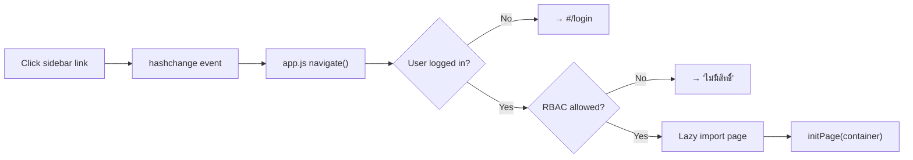

# MungkhudShop — AI Agent Onboarding Guide

> **Read this first if you are an AI agent tasked with modifying this project.**
> Last updated: 2026-03-17

> **Migration note (current runtime):** this project has moved from direct PocketBase access to the shared Express/NocoDB API. Use `src/services/pb.js` and `@shared/nocodb-adapter.js`; do not add new direct PocketBase SDK calls.

---

## What Is This Project?

MungkhudShop is a **Thai-language automotive service shop ERP** built with Vite + Vanilla JS over the shared Express/NocoDB backend. It manages jobs (car repairs), inventory (parts), purchasing (documents), and reports. The UI is entirely in Thai with a Glassmorphism design theme (Navy/Gold/White).

> [!CAUTION]
> **Do NOT:**
> - Install React, Vue, Tailwind, or any framework
> - Add direct PocketBase SDK calls; use `pb.js` / `@shared/nocodb-adapter.js`
> - Modify CSS design tokens without understanding the full Navy/Gold/White theme
> - Add English UI text — all user-facing text must be in Thai

---

## How to Start the App

```bash
# Option 1: Batch file (Windows)
double-click start-mungkhud.bat

# Option 2: Manual (two terminals)
npm run dev
```

| Resource | URL |
|----------|-----|
| Frontend | `http://localhost:4000` |
| API | Root Docker stack `/api/*` proxy to Express |

---

## Critical Files

| File | Why It Matters |
|------|---------------|
| `src/app.js` | **The brain.** Routes, auth guard, RBAC, branch switcher, SSO, dark mode, session timeout. (`app.js:473-495`) |
| `src/services/pb.js` | **Data layer.** Shim over shared Express/NocoDB adapter. |
| `src/services/auth.js` | **Security.** Login (username + PIN), session, RBAC, branch helpers, granular permissions. (`auth.js:1-257`) |
| `src/services/inventory.js` | **Stock engine.** Auto IN/OUT/ADJ ledger entries on document save/job close. |
| `src/services/crypto.js` | **Hashing.** SHA-256 password hashing with WebCrypto API. |
| `src/services/telegram.js` | **Notifications.** Telegram bot integration for alerts. |
| `src/services/pdf-engine.js` | **PDF.** Client-side PDF generation engine. |
| `src/services/excel-export.js` | **Excel.** Excel export utility. |
| `src/pages/document-factory.js` | **Factory.** Generates Search+Edit for 14 doc types. Changes affect ALL doc pages. |
| `src/pages/master-factory.js` | **Master data factory.** CRUD for 6 entity types. |
| `src/pages/job.js` | **Most complex page.** Autocomplete, favorites, evaluation, multi-payment, VAT. NOT a factory page. |
| `src/pages/kanban.js` | **Kanban.** Job status workflow board with drag-and-drop. |
| `src/components/ui.js` | **UI toolkit.** Tabs, grids, toasts, modals, autocomplete, VAT, CSV export. |
| `src/components/help.js` | **Help system.** Thai instructions for all routes. Update when adding pages. |
| `src/index.html` | **HTML shell.** Sidebar, topnav, branch switcher. Add nav items here. |
| `scripts/setup-db.js` | Legacy/local migration helper. Current schema lives in NocoDB migrations/root scripts. |

---

## How Routing Works



**To add a new route:**
1. Create `src/pages/my-page.js` with `export function initMyPage(container) { ... }`
2. Add to `ROUTES` in `app.js`: `'my-page': () => import('./pages/my-page.js').then(m => m.initMyPage)`
3. Add `<li data-page="my-page">` in `index.html` sidebar
4. Add Thai help in `help.js`
5. Add route to `system_roles.allowed_menus`

---

## How the Database Works

The shared Express API exposes PocketBase-compatible functions from `pb.js`:

```javascript
import { fetchList, fetchFullList, fetchOne, createRecord, updateRecord, deleteRecord } from '../services/pb.js'

// Filtering
const jobs = await fetchFullList('jobs', { filter: `status='open'` })

// Always pass requestKey: null to prevent race conditions
const docs = await fetchFullList('documents', { filter: `doc_type='IV'`, requestKey: null })
```

---

## How Stock Works

`stock_ledgers` is a **journal**. Current stock = `SUM(qty)` per product.

- Goods Receipt (RR) → `IN` (+qty)
- Requisition (RQ) → `OUT` (−qty)
- Job Close → `OUT` (−qty) for each job item
- Stock Return (RE) → `IN` (+qty)
- Adjustment (SA) → `ADJ` (±qty)

**Idempotent**: Every save deletes existing ledgers for that doc, then recreates them.

---

## How Auth Works

**NOT** using PocketBase built-in auth. The current app authenticates through Express `/api/auth/*` and the unified `users` table.

1. User enters credentials → `auth.js` queries `app_users`
2. Password checked: hashed first, plaintext fallback + auto-migration (`auth.js:34-57`)
3. Session stored in `localStorage.mungkhud_auth`
4. `app.js` checks `getCurrentUser()` on every route change
5. Sidebar filtered by `allowed_menus` string (`app.js:184-216`)

**PIN login**: Queries Management's PB instance (`managementPB`) for shared user database (`auth.js:104-162`)

**30-min session timeout**: Auto-logout after inactivity. Reset on mouse/key/touch events. (`app.js:280-308`)

---

## CSS Architecture

| File | Contents |
|------|----------|
| `design-system.css` | Tokens, resets, Google Fonts (Cormorant + Montserrat) |
| `layout.css` | Sidebar, topnav, grid/layout utilities |
| `components.css` | Cards, buttons, badges, forms, modals, toasts |
| `pages.css` | Page-specific styles (job, dashboard, data grids) |

**Key variables:**
```css
--color-primary: #C8A048;       /* Gold */
--color-bg-sidebar: #1E2A4F;    /* Navy */
--font-display: 'Cormorant';    /* Headings */
--font-body: 'Montserrat';      /* Body */
```

---

## Common Pitfalls

1. **`cfg.collection` in document-factory is NOT used.** Always queries `documents` filtered by `doc_type`.
2. **Tab switching cancels requests.** Use `{ requestKey: null }` for fetches during tab init.
3. **Product IDs are text codes, not PB record IDs.** `product_id` stores the product **code**.
4. **Dates from PB are UTC.** Use `.split(' ')[0]` for date-only comparisons.
5. **Help content must be updated.** Add entries in `help.js` when creating new pages.
6. **Autocomplete returns object.** `createAutocomplete()` returns `{ input, setValue, setSelectedId }`. Selected ID is in `input.dataset.selectedId`.
7. **VAT toggle state.** Use `vatToggle.getState()` → `{ vatEnabled, vatMode }`. Use `calcVat()` for math.
8. **Password migration.** Passwords auto-migrate from plaintext to SHA-256 hash on successful login (`auth.js:51-57`).

---

## Project Context

- Originally cloned from **UrsaShop** (Thai automotive SaaS reference)
- Rebranded to MungkhudShop for BC Bancha AutoXperience
- Styled with Glassmorphism (Navy/Gold/White)
- Connected to PocketBase with 19+ collections
- Extended with: custom auth, RBAC, PIN shared login, Thai help, autocomplete, VAT toggle, multi-shop, granular permissions, favorites, evaluation, multi-payment, kanban, dark mode, session timeout, Telegram alerts
- Sibling project: `Management/` — different Vite + PocketBase dashboard for business analytics. Shares user data via `managementPB`.
