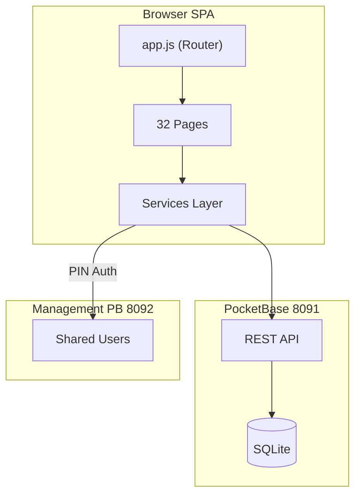

# MungkhudShop — Project Documentation & AI Context
**v2.1** — Last updated: 2026-03-17

---

## 1. Project Overview

MungkhudShop is a feature-rich **Thai-language automotive service ERP** for BC Bancha AutoXperience. It manages services/sales (jobs), inventory, purchasing, master data, reports, multi-shop branches, and granular user permissions.

| Attribute | Value |
|-----------|-------|
| **Language** | Thai (UI strictly in Thai) |
| **Frontend** | Vite + Vanilla JS + HTML/CSS (no frameworks) |
| **Backend** | PocketBase on `localhost:8091` |
| **Routing** | Hash-based SPA (`#/dashboard`, `#/job`, etc.) with lazy loading |
| **Build** | 48+ modules, 0 errors |
| **Cross-App Auth** | PIN login via Management PB + SSO tokens |

---

## 2. UI/UX Design System

- **Colors**: Navy `#1E2A4F`, Gold `#C8A048`, White `#F8FAFC`
- **Typography**: `Cormorant` (headings), `Montserrat` (body)
- **Glassmorphism**: `rgba(255, 255, 255, 0.08)`, `backdrop-filter: blur(12px)`
- **Dark Mode**: Toggle in topnav, persisted to `localStorage`
- **Components**: Custom CSS (`design-system.css`, `layout.css`, `components.css`, `pages.css`)

---

## 3. Architecture

For full architecture details, see [docs/ARCHITECTURE.md](docs/ARCHITECTURE.md).

---

## 4. State of the Project

1. ✅ **App Shell** — Collapsible sidebar, topnav, branch switcher, dark mode
2. ✅ **Master Data** — Companies, Customers, Vehicles, Products, Vendors, Lookups, Brands, Groups, Branches
3. ✅ **Service/Sales (Job)** — Autocomplete, VAT toggle, favorites, evaluation, multi-payment
4. ✅ **Kanban Board** — Job status workflow with branch badges
5. ✅ **Document Factory** — 14 doc types with entity/product autocomplete, VAT toggle
6. ✅ **Inventory** — Stock List, Requisition, Return, Transfer, Adjustment
7. ✅ **Purchasing** — Goods Receipt, Purchase Invoice, Purchase CN, Payment, WHT
8. ✅ **Reports** — Sales, Inventory, Finance with quick date buttons + CSV export
9. ✅ **Print Templates** — VAT-aware with dynamic columns
10. ✅ **Dashboard** — 5 stat cards, branch-aware, today's revenue, quick actions
11. ✅ **Settings** — VAT defaults, print layout config
12. ✅ **User Permissions** — 14 granular permissions across 5 groups
13. ✅ **Multi-Shop** — Branch CRUD, branch switcher, data filtering
14. ✅ **Cross-App** — SSO, PIN shared auth, back-to-management, embedded mode
15. ✅ **Alerts** — Low-stock notifications with audio + Telegram integration

---

## 5. Technical Details

- **PocketBase Schema**: 19+ collections (see `scripts/setup-db.js`)
- **Port Allocation**: Vite dev `4000`, PocketBase `8091`
- **Auto-generated IDs**: `PREFIX-YYMM-NNNN` via `generateDocId()`
- **Session timeout**: 30 minutes inactivity (`app.js:280-308`)
- **Password hashing**: SHA-256 via WebCrypto (`services/crypto.js`)

---

## 6. Key UI Components (`ui.js`)

| Component | Purpose |
|-----------|---------|
| `createAutocomplete()` | Type-ahead with debounce, keyboard nav |
| `createDropdown()` | `<select>` from PocketBase collections |
| `createVatToggle()` | On/off + customer_pays/shop_absorbs |
| `calcVat()` | VAT math helper |
| `exportCSV()` | UTF-8 BOM CSV export |
| `renderDataGrid()` | HTML table from column definitions |
| `showToast()` | Floating notifications |
| `showConfirm()` | Promise-based confirmation modal |

---

## 7. AI Agent Instructions

> [!IMPORTANT]
> - **Do NOT** introduce React, Vue, Tailwind, or external heavy libraries
> - Follow Glassmorphism theme using CSS variables from `design-system.css`
> - All alerts, placeholders, and error messages must be in **Thai**
> - For CRUD pages, use factory patterns (`master-factory.js`, `document-factory.js`)
> - For autocomplete, use `createAutocomplete()` from `ui.js`
> - For VAT, use `createVatToggle()` + `calcVat()`
> - For branch-aware data, use `getBranchFilter()` from `auth.js`
> - For permissions, use `hasPermission(key)` from `auth.js`

See [docs/AI_AGENT_GUIDE.md](docs/AI_AGENT_GUIDE.md) for detailed onboarding.
