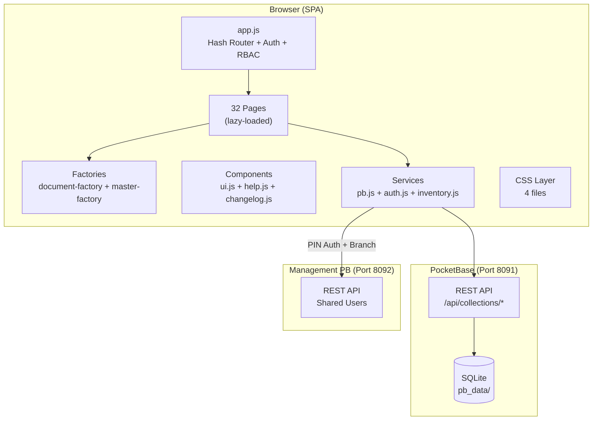
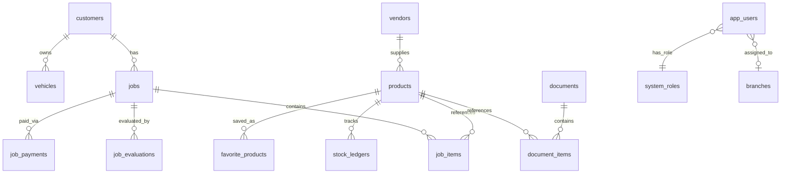

# MungkhudShop — Architecture & Technical Reference

> **Definitive technical reference for AI agents and developers.**
> Last updated: 2026-03-17

---

## 1. Executive Summary

MungkhudShop is a **Thai-language automotive repair shop ERP/SaaS** for **BC Bancha AutoXperience**. It manages jobs (vehicle service), inventory (parts), purchasing (supplier documents), and financial reports.

| Attribute | Value |
|-----------|-------|
| **Stack** | Vite 6 + Vanilla JS + PocketBase (SQLite BaaS) |
| **UI Theme** | Glassmorphism — Navy `#1E2A4F` / Gold `#C8A048` / White |
| **Language** | All UI text in Thai |
| **Pages** | 32 routable pages across 8 module groups |
| **Auth** | Custom RBAC with 3 roles + 14 granular permissions |
| **Multi-Shop** | Branch-aware data filtering + branch switcher |
| **Dev Server** | `http://localhost:4000` (Vite) |
| **Database** | `http://127.0.0.1:8091` (PocketBase) |

---

## 2. Architecture Overview



### Design Decisions

| Decision | Rationale |
|----------|-----------|
| **Vanilla JS** | Matches Management stack; zero framework complexity |
| **Hash routing (`#/route`)** | No server-side routing; works with static hosting |
| **PocketBase** | Single binary; auto-generated REST; admin UI included |
| **Custom auth (not PB auth)** | Avoids PB SDK quirks; simpler for internal tool (`auth.js:1-5`) |
| **Factory pattern** | `document-factory.js` + `master-factory.js` generate CRUD for 20+ pages |
| **Lazy loading** | Dynamic `import()` for all routes except dashboard (`app.js:14-47`) |
| **Shared PIN auth** | `managementPB` queries Management's `users` collection (`pb.js:10-24`) |

---

## 3. File Structure

```
MungkhudShop/
├── package.json              # NPM config
├── vite.config.js            # Vite config (root: src, port: 4000)
├── pocketbase.exe            # PocketBase binary (port 8091)
├── start-mungkhud.bat        # Startup script
├── pb_data/                  # ⚠ SQLite database (do NOT delete)
├── scripts/
│   ├── setup-db.js           # Creates 19+ PocketBase collections
│   ├── setup-auth.js         # Creates auth + default users
│   ├── patch-schema.js       # Schema patching utility
│   └── seed-test-kanban.mjs  # Test data seeder
├── src/
│   ├── index.html            # Single HTML shell (sidebar + topnav)
│   ├── app.js                # ★ Router, auth guard, RBAC, boot sequence
│   ├── assets/css/
│   │   ├── design-system.css # CSS tokens, resets, Google Fonts
│   │   ├── layout.css        # Sidebar, topnav, grid
│   │   ├── components.css    # Cards, buttons, modals, toasts
│   │   └── pages.css         # Page-specific styles
│   ├── components/
│   │   ├── ui.js             # ★ Shared UI: tabs, grids, toasts, autocomplete
│   │   ├── help.js           # Thai help instructions per route
│   │   └── changelog.js      # Version changelog modal
│   ├── services/
│   │   ├── pb.js             # ★ PocketBase CRUD + audit + Management PB
│   │   ├── auth.js           # ★ Login, RBAC, branch, permissions
│   │   ├── inventory.js      # Stock ledger posting (IN/OUT/ADJ)
│   │   ├── crypto.js         # SHA-256 password hashing
│   │   ├── excel-export.js   # Excel export utility
│   │   ├── pdf-engine.js     # PDF generation engine
│   │   └── telegram.js       # Telegram notification service
│   └── pages/                # 32 page controllers + 2 factories
└── docs/                     # This documentation
```

---

## 4. Core Components Deep Dive

### 4.1 Router (`app.js`)

Boot sequence (`app.js:473-495`):
1. `handleSSO()` — Decode SSO token from URL if present
2. `initSidebar()` — Desktop collapsible sidebar
3. `initMobileMenu()` — Hamburger menu for mobile
4. `initHelpButton()` — Floating help button
5. `initLogout()` — Logout button handler
6. `initBackToMgmt()` — "Back to Management" for SSO users
7. `initDarkMode()` — Theme toggle
8. `initSessionTimeout()` — 30-min inactivity logout
9. `filterSidebarByRole()` — Hide unauthorized nav items
10. `initBranchSwitcher()` — Populate branch dropdown from Management
11. `navigate(route)` — Initial route

**Navigation flow** (`app.js:58-156`):
```
hashchange → getRouteFromHash() → auth check → RBAC check → render page
                                      ↓              ↓
                                  → #/login     → "ไม่มีสิทธิ์" message
```

### 4.2 PocketBase Service (`services/pb.js`)

6 CRUD functions with built-in error handling (`pb.js:62-110`):

| Function | Returns |
|----------|---------|
| `fetchList(collection, page, perPage, options)` | `{ items, totalItems, totalPages }` |
| `fetchFullList(collection, options)` | Array of all records |
| `fetchOne(collection, id)` | Single record |
| `createRecord(collection, data)` | Created record (+ audit log) |
| `updateRecord(collection, id, data)` | Updated record (+ audit log) |
| `deleteRecord(collection, id)` | void (+ audit log) |

**Cross-app PB**: `managementPB` connects to Management's PocketBase for shared PIN auth (`pb.js:10-24`).

### 4.3 Auth Service (`services/auth.js`)

- **Session key**: `localStorage.mungkhud_auth` (`auth.js:10`)
- **Login methods**: Username/password (`auth.js:34-86`) + PIN via Management PB (`auth.js:104-162`)
- **Password hashing**: SHA-256 via `crypto.js`, with plaintext fallback + auto-migration (`auth.js:36-57`)
- **Branch helpers**: `getBranch()`, `setBranch()`, `getBranchFilter()` (`auth.js:213-233`)
- **Permissions**: `hasPermission(key)` checks JSON permissions, admin always true (`auth.js:245-255`)

### 4.4 Inventory Service (`services/inventory.js`)

| Doc Type | Transaction | Direction |
|----------|-----------|-----------|
| `RR` (Goods Receipt) | `IN` | +qty |
| `RE` (Stock Return) | `IN` | +qty |
| `RQ` (Requisition) | `OUT` | -qty |
| `JOB` (Job Close) | `OUT` | -qty |
| `SA` (Stock Adjust) | `ADJ` | ±qty |
| `TF` (Transfer) | `ADJ` | ±qty |

**Idempotency**: On save, existing ledger entries for the document are deleted first, then recreated.

### 4.5 Document Factory (`pages/document-factory.js`)

One-liner page pattern:
```javascript
import { createDocumentPage } from './document-factory.js'
export const initInvoicePage = createDocumentPage({
    title: 'ใบแจ้งหนี้ / ใบกำกับภาษี',
    icon: 'receipt_long',
    prefix: 'IV',   // doc_type filter + ID prefix
})
```

> [!IMPORTANT]
> `cfg.collection` is a legacy prop — the factory always queries the `documents` collection filtered by `doc_type='${prefix}'`.

### 4.6 UI Components (`components/ui.js`)

| Function | Purpose |
|----------|---------|
| `createTabs(container, tabs)` | Tab bar for Search/Add-Edit |
| `renderDataGrid({columns, items})` | HTML table from column definitions |
| `showToast(message, type)` | Floating notification |
| `showConfirm(title, message)` | Promise-based confirmation modal |
| `formatDate(dateStr)` | Thai date formatting |
| `formatCurrency(num)` | ฿ with 2 decimals |
| `generateDocId(prefix, count)` | Auto-ID: PREFIX-YYMM-NNNN |
| `createAutocomplete(opts)` | Type-ahead with debounce + keyboard nav |
| `createDropdown(opts)` | `<select>` from PocketBase collection |
| `createVatToggle(opts)` | VAT on/off + customer_pays/shop_absorbs |
| `calcVat(subtotal, disc, enabled, mode)` | VAT calculation |
| `exportCSV(filename, columns, items)` | UTF-8 BOM CSV export |

---

## 5. Data Model



### Collections (19 total)

**Master**: `companies`, `customers`, `vehicles`, `products`, `vendors`, `lookups`, `branches`, `product_brands`, `product_groups`

**Transactional**: `jobs`, `job_items`, `documents`, `document_items`, `stock_ledgers`, `favorite_products`, `job_evaluations`, `job_payments`

**Auth/System**: `app_users`, `system_roles`, `settings`, `audit_logs`

---

## 6. Routing Map

| Hash Route | Page File | Module |
|------------|-----------|--------|
| `#/dashboard` | `dashboard.js` | Core |
| `#/job` | `job.js` | Service/Sales |
| `#/kanban` | `kanban.js` | Service/Sales |
| `#/quotation` | `quotation.js` | Service/Sales |
| `#/invoice` | `invoice.js` | Service/Sales |
| `#/receipt` | `receipt.js` | Service/Sales |
| `#/credit-note` | `credit-note.js` | Service/Sales |
| `#/stock-list` | `stock-list.js` | Inventory |
| `#/requisition` | `requisition.js` | Inventory |
| `#/stock-return` | `stock-return.js` | Inventory |
| `#/stock-transfer` | `stock-transfer.js` | Inventory |
| `#/stock-adjust` | `stock-adjust.js` | Inventory |
| `#/goods-receipt` | `goods-receipt.js` | Purchasing |
| `#/purchase-invoice` | `purchase-invoice.js` | Purchasing |
| `#/purchase-cn` | `purchase-cn.js` | Purchasing |
| `#/payment` | `payment.js` | Purchasing |
| `#/withholding-tax` | `withholding-tax.js` | Purchasing |
| `#/master-company` thru `#/master-lookup` | Various | Master Data |
| `#/master-brand` | `master-brand.js` | Master Data |
| `#/master-group` | `master-group.js` | Master Data |
| `#/report-sales` | `report-sales.js` | Reports |
| `#/report-inventory` | `report-inventory.js` | Reports |
| `#/report-finance` | `report-finance.js` | Reports |
| `#/forms` | `forms.js` | Reports |
| `#/settings` | `settings.js` | Settings |
| `#/user-permissions` | `user-permissions.js` | Settings |
| `#/master-branch` | `master-branch.js` | Settings |
| `#/login` | `login.js` | Auth |

---

## 7. Security Model

### Default Credentials

| Username | Password | Role | Access |
|----------|----------|------|--------|
| `admin` | `admin1234` | admin | All menus (`*`) |
| `manager` | `manager1234` | manager | All except settings |
| `staff` | `staff1234` | employee | Dashboard, Job, Stock List |

PocketBase Superuser: `admin@mungkhudshop.local` / `adminpassword123`

> [!CAUTION]
> All PocketBase collections have **open rules** (empty strings). Security is enforced at the frontend routing level only. Add server-side rules before public deployment.

---

## 8. Development Guide

### Quick Start
```bash
cd MungkhudShop
npm install
.\pocketbase.exe serve --http=127.0.0.1:8091   # Terminal 1
npm run dev                                       # Terminal 2
# Open http://localhost:4000
```

### First-Time DB Setup
```bash
.\pocketbase.exe superuser upsert admin@mungkhudshop.local adminpassword123
node scripts/setup-db.js
node scripts/setup-auth.js
```

### Adding a New Page
1. Create `src/pages/my-page.js` with `export function initMyPage(container) { ... }`
2. Add to `ROUTES` in `app.js`: `'my-page': () => import('./pages/my-page.js').then(m => m.initMyPage)`
3. Add `<li data-page="my-page">` to `index.html` sidebar
4. Add Thai help in `components/help.js`
5. Add route to `system_roles.allowed_menus`

### Adding a Document Type
```javascript
import { createDocumentPage } from './document-factory.js'
export const initMyDocPage = createDocumentPage({
    title: 'ใบ XYZ',
    icon: 'description',
    prefix: 'XYZ',
})
```

---

## 9. Known Limitations

| Item | Status |
|------|--------|
| Password hashing | ⚠️ Auto-migration exists but not enforced |
| PDF generation | ❌ HTML print only |
| Multi-warehouse | ❌ `warehouse_location` defaults to "Main" |
| Server-side auth | ❌ PB rules are open |
| Report charts | ❌ Data grids only |
| Mobile responsive | ⚠️ Sidebar collapses but grids may overflow |
| Multi-shop | ✅ Branch CRUD + switcher + filtering |
| Autocomplete | ✅ Plate, customer, product |
| VAT toggle | ✅ customer_pays / shop_absorbs |
| Permissions | ✅ 14 granular permissions |
| Dark mode | ✅ Theme toggle |
| Kanban board | ✅ Job status workflow |

---

## 10. Troubleshooting

| Problem | Solution |
|---------|----------|
| Login fails | Ensure PocketBase running. Run `node scripts/setup-auth.js` |
| "unauthorized" message | Check `system_roles.allowed_menus` for user's role |
| Empty data grids | Re-run `node scripts/setup-db.js` |
| Port 4000 in use | Change in `vite.config.js` → `server.port` |
| Port 8091 in use | Kill PocketBase: `taskkill /IM pocketbase.exe /F` |
| "Cannot find module" | Run `npm install` |
