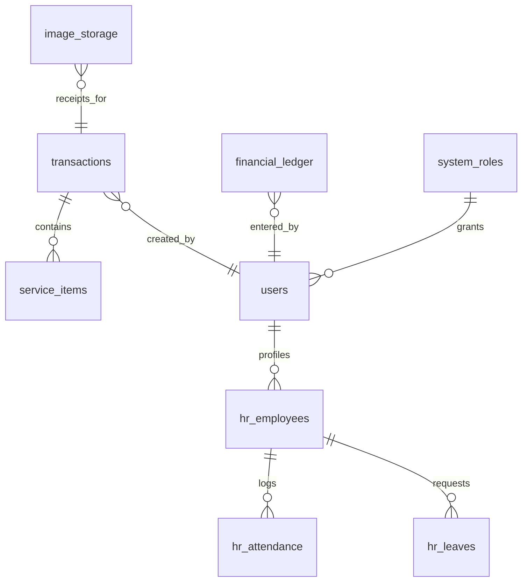

# BC Auto Portal — Schema Reference

> Technical reference for ALL PocketBase collections. AI agents **MUST** verify field names against this doc.
> Last updated: 2026-03-17

---

## Entity Relationship Diagram

---

## 1. Core Operational Collections

### `transactions`
Primary table for job-level summary data (imported).

| Field | Type | Required | Notes |
|-------|------|----------|-------|
| `job_id` | Text | ✓ | Unique job identifier (format: BC-XXXX) |
| `open_date` | Date | | Job start timestamp |
| `close_date` | Date | | Job completion timestamp |
| `customer_name` | Text | | Client name |
| `car_registration` | Text | | Vehicle plate number |
| `total_revenue` | Number | | Sum of service charges |
| `total_cost` | Number | | Sum of material costs |
| `total_profit` | Number | | Revenue − Cost |
| `branch` | Select | | `BC Auto Service`, `suphanburi`, or `samchuk` |

### `service_items`
Line-item details per transaction.

| Field | Type | Required | Notes |
|-------|------|----------|-------|
| `job_id` | Text | ✓ | FK to `transactions.job_id` |
| `item_name` | Text | | Service/part description |
| `quantity` | Number | | Unit count |
| `total_price` | Number | | Sales value |
| `total_cost` | Number | | Cost value |
| `total_profit` | Number | | Margin |
| `branch` | Select | | Branch isolation key |

### `product_groups`
Monthly aggregated category-level analysis.

| Field | Type | Required | Notes |
|-------|------|----------|-------|
| `name` | Text | | Category name |
| `code` | Text | | Category code |
| `total_sales` | Number | | Monthly sales total |
| `total_profit` | Number | | Monthly profit |
| `total_cost` | Number | | Monthly cost |
| `report_month` | Text | | Format: `YYYY-MM` |
| `branch` | Select | | Branch isolation key |

---

## 2. Financial Ledger

### `financial_ledger`
Unified table for manual revenue, expense, and owner withdrawal entries.

| Field | Type | Required | Notes |
|-------|------|----------|-------|
| `date` | Date | ✓ | Transaction date |
| `amount` | Number | ✓ | THB value |
| `category` | Text | | Classification (maps from UI `description`) |
| `entry_type` | Select | | `revenue`, `expense`, or `owner_withdrawal` |
| `verified` | Bool | | Managerial confirmation (required for dashboard inclusion) |
| `is_confidential` | Bool | | Restricted to admin/owner |
| `excluded` | Bool | | `true` = COGS (material purchase, excluded from Opex) |
| `receipt_url` | File | | Reference to receipt image |
| `branch` | Select | | Branch isolation key |

---

## 3. HR (Human Resources)

### `hr_employees`
| Field | Type | Required | Notes |
|-------|------|----------|-------|
| `emp_id` | Text | ✓ | Employee identifier (unique) |
| `name` | Text | ✓ | Full name |
| `department` | Text | | e.g., "Mechanic", "Front Office" |
| `sex` | Text | | Gender |

### `hr_attendance`
| Field | Type | Required | Notes |
|-------|------|----------|-------|
| `employee_id` | Text | | FK to `hr_employees.emp_id` |
| `date` | Date | | Attendance date |
| `status` | Text | | "Present", "Late", "Absent" |
| `store` | Text | | Branch reference |
| `check_in` | Date | | Clock-in timestamp |
| `check_out` | Date | | Clock-out timestamp |

### `hr_leaves`
| Field | Type | Required | Notes |
|-------|------|----------|-------|
| `employee_id` | Text | | FK to `hr_employees.emp_id` |
| `start_date` | Date | | Leave start |
| `end_date` | Date | | Leave end |
| `type` | Text | | "Sick", "Personal", "Vacation" |
| `reason` | Text | | Description |

---

## 4. Identity & Auth

### `users`
Unified identity table for all roles (admin, owner, manager, SA, mechanic).

| Field | Type | Required | Notes |
|-------|------|----------|-------|
| `name` | Text | ✓ | Display name |
| `email` | Email | | For admin/owner login |
| `pin` | Text | | PIN code for SA/mechanic login (hidden from API) |
| `role` | Select | | `admin`, `owner`, `manager`, `sa`, `mechanic` |
| `branch` | Text | | Assigned branch |
| `active` | Bool | | Must be `true` to login |
| `display_name` | Text | | Thai display name |
| `last_force_logout` | Date | | Force-logout timestamp |

---

## 5. System & Storage

### `image_storage`
| Field | Type | Notes |
|-------|------|-------|
| `file` | File | Uploaded image/receipt |
| `tool_reference` | Text | Originating tool (for audit trail) |

### `system_settings`
| Field | Type | Required | Notes |
|-------|------|----------|-------|
| `key` | Text | ✓ | Unique setting identifier (e.g., `bctool_link`) |
| `value` | JSON | | Setting data (any type) |
| `description` | Text | | Human-readable explanation |

Used by `ConfigService.getSetting(key)`. (`configService.js:83-85`)

### `system_roles`
| Field | Type | Notes |
|-------|------|-------|
| `role_name` | Text | `admin`, `owner`, `manager`, `sa`, `mechanic` |
| `allowed_tools` | JSON | Array of tool IDs from `registry.js` |

### `audit_logs`
| Field | Type | Notes |
|-------|------|-------|
| `timestamp` | Date | Event time |
| `user_name` | Text | Acting user |
| `role` | Text | User's role at time of action |
| `action` | Text | e.g., `create_transactions`, `update_users` |
| `details` | Text | Verbose change description |

---

> [!IMPORTANT]
> Always check for the `branch` field when querying any collection to ensure proper data isolation!
