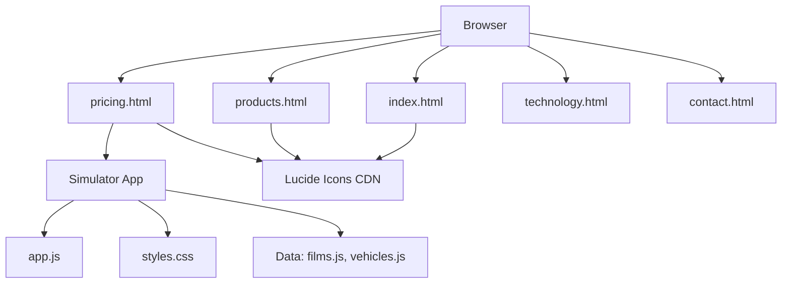

# Architecture

> Auto-generated by /map on 2026-05-07

## Overview

The Glassify website (`website-light`) is a static, multi-page web application (MPA) serving as the marketing and product showcase for the Glassify automotive window film brand. It includes an interactive film simulator for pricing and visual demonstration.

## Components

### Core Pages
- **Purpose:** Static content delivery for marketing, products, and contact.
- **Location:** `/*.html` (e.g., `index.html`, `products.html`)
- **Dependencies:** Google Fonts, Lucide Icons (CDN)

### Simulator App
- **Purpose:** Interactive tool allowing users to preview window film effects on different vehicle types and calculate pricing.
- **Location:** `/simulation`
- **Dependencies:** Vanilla JS (`app.js`), local data structures (`films.js`, `vehicles.js`)

### Build Scripts
- **Purpose:** Custom Node.js scripts for batch text replacements and static site generation/merging.
- **Location:** `/global_replace.js`, `/merge_sim.js`, `/apply_fixes.js`
- **Dependencies:** Node.js `fs` module

## Data Flow

1. **Static Delivery:** User requests HTML page; browser downloads HTML, inline CSS, and local assets (`/images`, `/videos`).
2. **Icon Rendering:** Lucide CDN script loads and `lucide.createIcons()` executes inline on page load.
3. **Simulation Interaction:** User interacts with UI controls in `pricing.html` -> `simulation/app.js` updates DOM states, filters data from `data/`, and dynamically updates SVG overlays and price displays.

## Integration Points

| Service | Type | Purpose |
|---------|------|---------|
| Google Fonts | CDN | Typography (Outfit, Inter, Noto Sans Thai) |
| Lucide Icons | CDN | SVG UI Icons |

## Technical Debt

- [ ] **Lack of Module Bundler:** Currently relying on ad-hoc Node.js scripts instead of a standard bundler (Vite/Webpack).
- [ ] **Inline Scripting/Styling:** Significant logic and CSS is embedded directly in HTML files, reducing maintainability.
- [ ] **No Form Backend:** The contact form has no submission logic or API endpoint.
- [ ] **No Test Coverage:** No unit or E2E tests for the simulator logic.

## Conventions

**Naming:** Kebab-case for HTML files and directories.
**Structure:** Flat HTML structure with a dedicated `simulation` folder for complex interactive components.
**Styling:** Native CSS variables with glassmorphism design tokens (`--glass-card`, `--brand-glow`).
