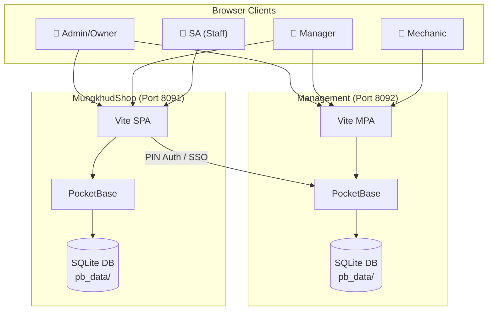

# BC Auto Xperience — ERP Platform

> **Two complementary apps** powering the BC Bancha AutoXperience auto-service business across multiple branches in Thailand.

## Platform Overview

| App | Purpose | Port | Stack |
|-----|---------|------|-------|
| **Management** | Back-office analytics: Revenue, P&L, HR, Audit, Admin | `8092` (prod) / `3000` (dev) | Vite MPA + PocketBase + Chart.js |
| **MungkhudShop** | Front-office shop ERP: Jobs, Inventory, Purchasing, Reports | `8091` (prod) / `4000` (dev) | Vite SPA + PocketBase + Vanilla JS |

Both apps use **PocketBase** (self-contained SQLite-backed BaaS) as their backend. They share user data for cross-app authentication via SSO tokens and PIN-based login.



## Quick Start

### Docker (Recommended)
```bash
docker compose up -d
# Management: http://localhost:8092/pages/main/index.html
# MungkhudShop: http://localhost:8091
```

### Manual (Windows)
```bash
# Terminal 1 — Management
cd Management
./pocketbase.exe serve --http=0.0.0.0:8092

# Terminal 2 — Management Dev Server
cd Management
npm run dev

# Terminal 3 — MungkhudShop
cd MungkhudShop
./pocketbase.exe serve --http=127.0.0.1:8091

# Terminal 4 — MungkhudShop Dev Server
cd MungkhudShop
npm run dev
```

Or use the batch launchers:
- `Management/BC_AUTO_MANAGEMENT.bat` — Starts Management (PocketBase + Cloudflare tunnel)
- `MungkhudShop/start-mungkhud.bat` — Starts MungkhudShop (PocketBase + Vite)

## Project Structure

```
ERP/
├── Management/           # Back-office analytics app
│   ├── src/              # Vite MPA source (pages, services, components)
│   ├── pb_data/          # PocketBase database
│   ├── pb_migrations/    # Schema migration scripts
│   ├── pb_public/        # Built frontend (served by PocketBase)
│   ├── scripts/          # DB setup, migration, debug utilities
│   ├── Docs/             # Architecture, business rules, UI patterns
│   └── documentation.md  # Comprehensive reference doc
├── MungkhudShop/         # Front-office shop ERP app
│   ├── src/              # Vite SPA source (single index.html + app.js router)
│   ├── pb_data/          # PocketBase database
│   ├── scripts/          # DB setup, auth setup
│   ├── docs/             # Architecture, AI agent guide, changelog
│   └── mungkhudshop_docs.md
├── shared/               # Shared CSS design tokens
├── tests/                # Playwright end-to-end tests
├── docker-compose.yml    # Production Docker setup
├── docker-compose.test.yml  # Test environment (ports 9091/9092)
├── backup.bat            # Database backup script
├── auto_backup.bat       # Automated backup scheduler
└── update_production.bat # Production deployment script
```

## Roles & Access

| Role | Management Access | MungkhudShop Access | Auth Method |
|------|-------------------|---------------------|-------------|
| `admin` | Full system | Full system | Email + Password |
| `owner` | All branches, all tools | All branches, all tools | Email + Password |
| `manager` | Own branch, most tools | Own branch, most tools | Email + Password |
| `sa` | Operations menu, checkin | All except settings/reports | PIN login |
| `mechanic` | Check-in/out only | — | PIN login |

## Documentation Index

### Root-Level
- [Principal-Level Onboarding](PRINCIPAL_ONBOARDING.md) — Architecture deep-dive for senior engineers
- [Zero-to-Hero Guide](ZERO_TO_HERO.md) — Step-by-step contributor walkthrough

### Management
- [documentation.md](../Management/documentation.md) — Comprehensive Management reference
- [Docs/architecture_state.md](../Management/Docs/architecture_state.md) — System architecture & backend state
- [Docs/business_rules.md](../Management/Docs/business_rules.md) — Business logic & operational rules
- [Docs/schema_reference.md](../Management/Docs/schema_reference.md) — PocketBase collection schemas
- [Docs/ui_patterns.md](../Management/Docs/ui_patterns.md) — Design system & UI patterns
- [Docs/verification_protocol.md](../Management/Docs/verification_protocol.md) — Pre-deployment checklist
- [Docs/troubleshooting.md](../Management/Docs/troubleshooting.md) — Common issues & solutions

### MungkhudShop
- [docs/ARCHITECTURE.md](../MungkhudShop/docs/ARCHITECTURE.md) — Full technical reference
- [docs/AI_AGENT_GUIDE.md](../MungkhudShop/docs/AI_AGENT_GUIDE.md) — AI agent onboarding guide
- [docs/CHANGELOG.md](../MungkhudShop/docs/CHANGELOG.md) — Version history

## Testing

```bash
# Prerequisites
pip install playwright
python -m playwright install chromium

# Start test containers
docker compose -f docker-compose.test.yml up -d --build

# Run tests
python tests/test_mungkhudshop.py
```

## Deployment

### Production Update
```bash
.\update_production.bat
```
This rebuilds Docker containers, runs builds, and restarts services.

### Backup
```bash
.\backup.bat
# Or use the Admin Suite → Backup Center in the Management app
```
