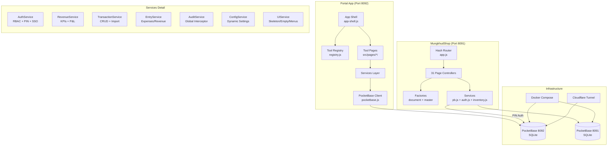
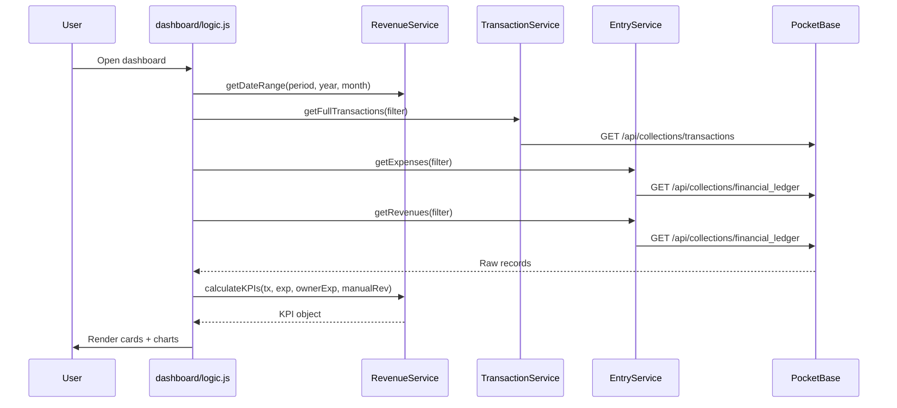
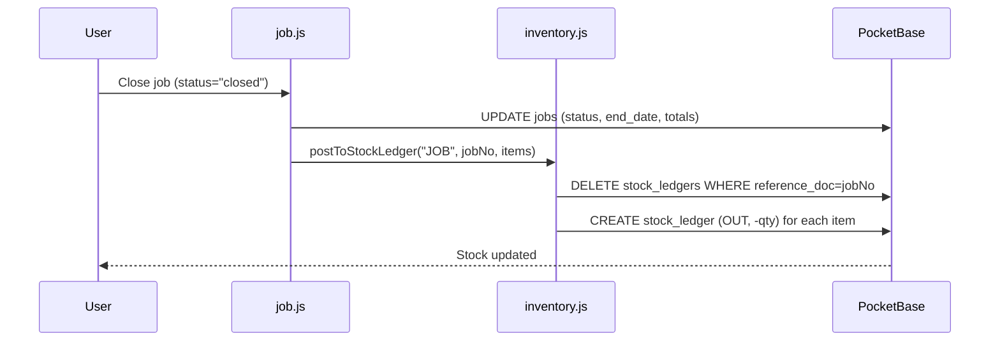

# BC Auto Xperience — Principal-Level Onboarding

> **Audience**: Senior/staff+ engineers who need the "why" behind decisions.
> Last updated: 2026-03-17

---

## 1. System Philosophy & Design Principles

The BC Auto Xperience ERP platform was designed around these core invariants:

1. **Convention over Configuration** — Every feature ("tool") in the Portal app follows the exact same pattern: register in `registry.js`, create an HTML page, write logic in `logic.js`. The registry is the single source of truth. (`Portal/src/registry.js:1-25`)

2. **Branch-Neutral Architecture** — All operational code is branch-agnostic. Branches are treated as data filters, never directory structures. A single codebase serves 3+ branches. (`Portal/Docs/business_rules.md`, `Portal/src/services/authService.js:203-217`)

3. **Factory Pattern for Scale** — MungkhudShop uses factory functions (`document-factory.js`, `master-factory.js`) to generate identical CRUD UIs for 14+ document types and 6+ entity types from one-liner config files. (`MungkhudShop/src/pages/document-factory.js`, `MungkhudShop/src/pages/invoice.js`)

4. **Thai-First UI** — All user-facing text is in Thai. English is used only in code, comments, and documentation. (`Portal/Docs/ui_patterns.md:30-32`)

5. **Zero External Dependencies for Auth** — Both apps implement custom authentication instead of using PocketBase's built-in auth. Portal uses PocketBase `authWithPassword` for admin/owner + PIN login for staff. MungkhudShop queries a custom `app_users` collection. (`Portal/src/services/authService.js:79-92`, `MungkhudShop/src/services/auth.js:34-86`)

---

## 2. Architecture Overview

### Component Ownership

| Component | Owner | Communication |
|-----------|-------|---------------|
| Tool Registry | `Portal/src/registry.js` | Drives menu rendering + RBAC |
| App Shell | `Portal/src/assets/js/app-shell.js` | Wraps pages with sidebar/nav |
| Auth | `Portal/src/services/authService.js` | JWT (PB) + Session (PIN) |
| Revenue Engine | `Portal/src/services/revenueService.js` | Aggregates TX + Ledger |
| Audit Proxy | `Portal/src/services/pocketbase.js:18-65` | Global CRUD interceptor |
| Shop Router | `MungkhudShop/src/app.js` | Hash-based SPA with lazy loading |
| Document Factory | `MungkhudShop/src/pages/document-factory.js` | Generates 14 doc type UIs |
| Inventory Engine | `MungkhudShop/src/services/inventory.js` | Auto stock ledger posting |

---

## 3. Key Abstractions & Interfaces

### Portal: Tool Registry Pattern
The entire Portal app is a **convention-based tool registry**. Every feature is a "tool" with:
- `id` — Unique snake_case identifier
- `path` — HTML page URL
- `roles` — Array of roles that can access it
- `group` — Category (`financial`, `operations`, `hr`, `admin`)
- `hidden` — Whether shown in main menu (some tools live inside sub-menus)

(`Portal/src/registry.js:27-148`)

### Portal: Global Audit Proxy
All PocketBase `create`, `update`, `delete` operations are intercepted via a `Proxy` on `pb.collection()`. The proxy dynamically imports `AuditService` if not already loaded, ensuring 100% audit coverage without manual logging. (`Portal/src/services/pocketbase.js:18-65`)

### MungkhudShop: Document Factory
A single factory function generates a complete Search + Add/Edit UI for any document type. 14 page files are one-liners that call `createDocumentPage({ title, icon, prefix })`. The factory handles:
- Doc number auto-generation (PREFIX-YYMM-NNNN)
- Entity + product autocomplete
- VAT 7% toggle
- Stock ledger posting via `postToStockLedger()`

(`MungkhudShop/src/pages/document-factory.js`)

### MungkhudShop: Lazy Route Loading
Routes use dynamic `import()` for code splitting. Only the dashboard is eagerly loaded; all other pages load on-demand when navigated to. (`MungkhudShop/src/app.js:14-47`)

### ConfigService: Dynamic RBAC
Role permissions are stored in the `system_roles` PocketBase collection and cached in `localStorage`. The `ConfigService.hasAccess()` function checks dynamic permissions first, falling back to static defaults in the registry. Wrapper tools (e.g., `operations_menu`) get implicit access if any child tool is permitted. (`Portal/src/services/configService.js:49-78`)

---

## 4. Decision Log

| Decision | Alternatives Considered | Rationale |
|----------|------------------------|-----------|
| **PocketBase over Supabase/Firebase** | Supabase, Firebase, custom Express | Self-contained binary; works offline; no cloud dependency; auto-generated REST API; built-in admin UI; SQLite = zero config DB |
| **Vite MPA (Portal) vs SPA (MungkhudShop)** | Both could be SPA or MPA | Portal needs independent pages that can be built/deployed separately (admin tools, HR, dashboard). MungkhudShop is a tightly-integrated workflow app where SPA with hash routing makes sense |
| **Vanilla JS, no framework** | React, Vue, Svelte | Matches team skill set; reduces build complexity; avoids framework lock-in; PocketBase SDK + vanilla DOM is sufficient |
| **Custom Auth over PB Auth** | PocketBase built-in auth | Portal uses PB auth for admin/owner (JWT) but adds custom PIN login for SA/mechanic employees. MungkhudShop avoids PB auth entirely due to SDK quirks with custom collections |
| **Branch as data filter, not directory** | Separate codebases per branch | Single codebase = one build, one deploy, consistent updates across all branches |
| **Proxy-based audit logging** | Manual `AuditService.log()` calls | Global interceptor eliminates human error; 100% CRUD coverage automatically |

---

## 5. Dependency Rationale

| Dependency | Purpose | Why This One |
|------------|---------|-------------|
| **PocketBase** | Backend (DB + API + Auth + File Hosting) | Single binary, zero config, SQLite-backed, auto-generated REST |
| **Vite** | Build tool + Dev server | Fast HMR, native ESM support, simple config, MPA support |
| **Chart.js** | Revenue dashboard charts | Lightweight, well-documented, no dependencies |
| **XLSX (SheetJS)** | Excel import/export | Most complete JS library for Excel manipulation |
| **PocketBase JS SDK** | Client-side API calls | Official SDK with auth store, real-time subscriptions |
| **Cloudflare Tunnel** | Remote access without port forwarding | Free, secure, works behind NAT/firewall |

---

## 6. Data Flow & State

### Portal: Revenue Dashboard Flow

(`Portal/src/services/revenueService.js:41-62`)

### MungkhudShop: Job Save → Stock Posting Flow

(`MungkhudShop/src/services/inventory.js`)

### Cross-App SSO Flow
MungkhudShop supports SSO from Portal via Base64-encoded tokens:
1. Portal generates token: `AuthService.getSSOToken()` (`Portal/src/services/authService.js:252-272`)
2. Token passed as URL param: `?sso_token=...`
3. MungkhudShop decodes + validates (5-min expiry): `handleSSO()` (`MungkhudShop/src/app.js:350-410`)
4. PIN-based shared auth also supported via `portalPB` instance (`MungkhudShop/src/services/pb.js:10-24`)

---

## 7. Failure Modes & Error Handling

| Failure | Impact | Mitigation |
|---------|--------|------------|
| **PocketBase crash** | All API calls return 404/Connection Refused | `bc_auto_management.bat` starts PB as hidden background process; Docker `restart: unless-stopped` |
| **Vite inline script stripping** | Production UI breaks (elements stay `.hidden`) | Mandatory rule: extract all `<script type="module">` blocks into separate `.js` files (`Portal/documentation.md:39-42`) |
| **Service Worker cache staleness** | Users see old UI after deploy | Hard Refresh (`Ctrl+F5`) required; documented in `documentation.md:15` |
| **PocketBase filter syntax error** | 400 Bad Request on list/search | `getBranchFilter()` returns `'id!=""'` instead of empty string to prevent trailing `&&` (`Portal/src/services/authService.js:203-217`) |
| **Dynamic AuditService import failure** | Audit log gap | Proxy catches import errors gracefully; logs to console but doesn't block CRUD (`Portal/src/services/pocketbase.js:36-41`) |
| **Race condition on tab switch** | PocketBase auto-cancels concurrent requests | `pb.autoCancellation(false)` globally (`Portal/src/services/pocketbase.js:16`); MungkhudShop uses `requestKey: null` per-call |

---

## 8. Performance Characteristics

- **SQLite Bottleneck**: Both apps use single-file SQLite databases. Write contention is the primary scaling limit (~100 concurrent writes/sec). Read performance is excellent.
- **Client-Side Image Compression**: `compressImage()` in `helpers.js` resizes images before upload to reduce PocketBase storage and upload time.
- **Lazy Loading**: MungkhudShop uses dynamic `import()` for all pages except dashboard, reducing initial bundle size.
- **ConfigService Caching**: Role permissions and system settings are cached in `localStorage` with optimistic loading. PB fetch happens in background. (`Portal/src/services/configService.js:14-43`)
- **Hot Path**: The revenue dashboard is the most expensive page — it fetches `transactions`, `financial_ledger` (3 queries), and optionally `service_items` and `product_groups`. All queries are parallelized via `Promise.all`.

---

## 9. Security Model

### Authentication Layers

| Layer | Portal | MungkhudShop |
|-------|-----------|-------------|
| Admin/Owner login | PB `authWithPassword` (JWT) | N/A (uses SSO from Portal) |
| SA/Employee login | PIN code matched against `users` collection | PIN via Portal's PB instance (`portalPB`) |
| Session storage | `sessionStorage` (bcauto_role, bcauto_user_name) | `localStorage` (mungkhud_auth) |
| Session timeout | None (manual logout) | 30 minutes inactivity (`MungkhudShop/src/app.js:280-308`) |

### Authorization (RBAC)
- **Portal**: `ConfigService.hasAccess(role, toolId)` checks `system_roles.allowed_tools` in PocketBase, falls back to static `roles` array in `registry.js`. (`Portal/src/services/configService.js:49-78`)
- **MungkhudShop**: `hasAccess(hash)` checks `allowed_menus` string from user session. `*` = full access. (`MungkhudShop/src/services/auth.js:176-182`)

### Branch Isolation
- All data queries include `getBranchFilter()` to scope records to the user's assigned branch.
- Admin/owner with `branch='all'` gets `id!=""` (always-true filter).
- Employees are auto-locked to their assigned branch ID.

### Trust Boundaries

> [!CAUTION]
> MungkhudShop stores passwords as plaintext in the `app_users` collection (with auto-migration to SHA-256 hash on login). All PocketBase collection API rules are **wide open** — security is enforced at the frontend routing level only. Do NOT deploy to public internet without adding server-side rules.

---

## 10. Testing Strategy

### What's Tested
- **End-to-end Playwright tests** (`tests/test_mungkhudshop.py`): 10 tests covering login (PIN), dashboard, navigation, stock list, reports, settings, mobile responsive, session info, and Portal API access.
- Tests run against Docker test containers on ports 9091/9092.

### What's NOT Tested
- Unit tests for individual services/functions
- Portal app page-level tests
- Branch isolation verification (manual only)
- Financial calculation accuracy (manual only)
- Audit log completeness

### Testing Philosophy
The project uses a "smoke test + manual verification" approach. Playwright tests catch deployment regressions. Business logic is verified manually using the Verification Protocol (`Portal/Docs/verification_protocol.md`).

---

## 11. Operational Concerns

### Deployment
- **Docker**: `docker compose up -d` for production. `update_production.bat` handles full rebuild cycle.
- **Development**: `npm run dev` for Vite HMR. `npm run build` compiles to `pb_public/` (served by PocketBase).
- **Remote Access**: Cloudflare Tunnel via `cloudflared.exe` (Portal only). Token in `cf_token.txt`.

### Monitoring
- PocketBase admin panel: `http://localhost:8092/_/` (Portal), `http://localhost:8091/_/` (MungkhudShop)
- `audit_logs` collection tracks all CRUD operations
- Docker healthcheck pings `/api/health` every 30s

### Backup
- `backup.bat` / `auto_backup.bat` — Copies `pb_data/data.db`
- Admin Suite → Backup Center in Portal app
- `pb_data/` directory is the critical backup target

### Configuration
- `system_settings` collection — Dynamic key-value config (e.g., `bctool_link`, `feature_auto_audit`)
- `system_roles` collection — Dynamic role → tool mappings
- `ConfigService.init()` loads both on app startup with localStorage caching

---

## 12. Known Technical Debt

| Debt | Risk | Owner |
|------|------|-------|
| **Plaintext passwords in MungkhudShop** | Security vulnerability if exposed to internet | `MungkhudShop/src/services/auth.js:39-57` (auto-migration to hash exists but not enforced) |
| **Open PocketBase API rules** | Any client can read/write any collection | Both apps — needs server-side rules before public deployment |
| **No server-side validation** | Client-side validation can be bypassed | All forms — PocketBase rules are empty strings |
| **Service Worker cache invalidation** | Users must hard-refresh after updates | `Portal/public/sw.js` — needs versioned cache busting |
| **Legacy `employee` role references** | Some code still checks for `employee` instead of `sa` | Various files across both apps |
| **Stale file path references** | Old docs reference `w:/Works/Portal/` paths | `Portal/Docs/plans/` — plan files use old paths |
| **No PDF generation** | MungkhudShop uses HTML print only | `MungkhudShop/src/pages/forms.js` — needs `pdf-engine.js` integration |
| **Single-threaded SQLite** | Write contention at scale | Both `pb_data/data.db` files — consider PostgreSQL migration for 100+ concurrent users |
