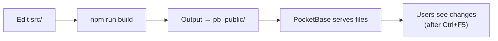

# BC Auto Xperience — Zero-to-Hero Contributor Guide

> **Audience**: New contributors who need step-by-step practical guidance.
> Last updated: 2026-03-17

---

## 1. What This Project Does

BC Auto Xperience is a **Thai-language ERP platform for auto repair shops**. It has two apps: **Portal** (revenue tracking, P&L analysis, HR, audit) and **MungkhudShop** (job management, inventory, purchasing, documents). Both run on PocketBase + Vite + Vanilla JS, deployed via Docker.

---

## 2. Prerequisites

| Tool | Version | Purpose |
|------|---------|---------|
| Node.js | 18+ | Vite build + npm scripts |
| NPM | 9+ | Package management |
| Docker Desktop | Latest | Container deployment |
| Windows | 10/11 | Development OS (batch scripts assume Windows) |
| Git | Latest | Version control |

Optional:
- Python 3.10+ + Playwright — for running E2E tests
- VS Code — recommended editor (Mermaid preview, ESLint)

---

## 3. Environment Setup

### Step 1: Clone and Install
```bash
# Clone the repository
git clone <repo-url>
cd ERP

# Install Portal dependencies
cd Portal
npm install

# Install MungkhudShop dependencies
cd ../MungkhudShop
npm install
cd ..
```

### Step 2: Start PocketBase (Database)
```bash
# Terminal 1 — Portal Database
cd Portal
.\pocketbase.exe serve --http=0.0.0.0:8092
# Expected output:
# > Server started at http://0.0.0.0:8092
# > Admin UI: http://0.0.0.0:8092/_/

# Terminal 2 — MungkhudShop Database
cd MungkhudShop
.\pocketbase.exe serve --http=127.0.0.1:8091
# Expected output:
# > Server started at http://127.0.0.1:8091
```

### Step 3: Start Dev Servers
```bash
# Terminal 3 — Portal Dev Server
cd Portal
npm run dev
# Expected output:
# > Local: http://localhost:3000/pages/main/index.html

# Terminal 4 — MungkhudShop Dev Server
cd MungkhudShop
npm run dev
# Expected output:
# > Local: http://localhost:4000/index.html
```

### Step 4: MungkhudShop First-Time DB Setup
```bash
cd MungkhudShop

# Create PocketBase superuser
.\pocketbase.exe superuser upsert admin@mungkhudshop.local adminpassword123

# Create all 19 collections
node scripts/setup-db.js

# Create auth tables + default users
node scripts/setup-auth.js
```

### Step 5: Verify
- Portal: `http://localhost:3000/pages/main/index.html` — Should show login screen
- MungkhudShop: `http://localhost:4000` — Should show login screen
- PB Admin: `http://localhost:8092/_/` — Should show PocketBase admin

---

## 4. Project Structure

```
ERP/
├── Portal/                    # 🏢 Back-office analytics
│   ├── src/
│   │   ├── registry.js            # ★ Source of truth: all tools listed here
│   │   ├── assets/
│   │   │   ├── js/app-shell.js    # ★ Auth routing + dynamic sidebar/nav
│   │   │   └── css/               # Design system CSS
│   │   ├── services/
│   │   │   ├── pocketbase.js      # ★ DB client + global audit proxy
│   │   │   ├── authService.js     # ★ Login/RBAC/branch methods
│   │   │   ├── configService.js   # Dynamic settings + role permissions
│   │   │   ├── revenueService.js  # KPI calculations
│   │   │   ├── transaction.js     # Transaction CRUD + import
│   │   │   ├── entry.js           # Expense/revenue entries
│   │   │   ├── auditService.js    # Audit logging
│   │   │   ├── uiService.js       # Skeleton loaders, empty states
│   │   │   └── reportService.js   # PDF export
│   │   ├── pages/
│   │   │   ├── main/              # App shell + main menu
│   │   │   ├── dashboard/         # Revenue dashboard
│   │   │   ├── branch-operations/ # DB, audit, entry, verification
│   │   │   ├── hr/                # HR dashboard, check-in, payroll
│   │   │   ├── admin/             # User mgmt, roles, backup, health
│   │   │   ├── operations/        # Operations sub-menu
│   │   │   └── _tool-template/    # ★ Copy this to create new tools
│   │   ├── components/            # Shared UI components
│   │   └── utils/helpers.js       # Formatters, debounce, compression
│   ├── pb_data/                   # ⚠ Database files (NEVER delete)
│   ├── pb_public/                 # Built output (auto-generated)
│   ├── scripts/                   # Migration/debug utilities
│   ├── Docs/                      # Architecture + business docs
│   └── vite.config.js             # Build config (all pages listed)
│
├── MungkhudShop/                  # 🏪 Front-office shop ERP
│   ├── src/
│   │   ├── index.html             # ★ Single HTML shell
│   │   ├── app.js                 # ★ Hash router + auth guard + RBAC
│   │   ├── pages/                 # 31 page controllers + 2 factories
│   │   │   ├── document-factory.js# ★ Generates 14 document type UIs
│   │   │   ├── master-factory.js  # ★ Generates 6 master data UIs
│   │   │   ├── job.js             # Most complex page (autocomplete, VAT, etc.)
│   │   │   └── ...
│   │   ├── services/
│   │   │   ├── pb.js              # ★ PocketBase CRUD + audit logging
│   │   │   ├── auth.js            # ★ Custom auth, RBAC, branch helpers
│   │   │   └── inventory.js       # Auto stock ledger posting
│   │   └── components/ui.js       # Shared UI helpers
│   ├── pb_data/                   # Database files
│   ├── scripts/                   # setup-db.js, setup-auth.js
│   └── docs/                      # Architecture, AI guide, changelog
│
├── shared/design-tokens.css       # Shared CSS variables
├── tests/test_mungkhudshop.py     # Playwright E2E tests
├── docker-compose.yml             # Production deployment
└── docs/                          # Root-level documentation
```

> ★ = Files you should understand before making changes

---

## 5. Your First Task: Adding a New Tool to Portal

Let's walk through adding a "Kanban Board" tool to the Portal app.

### Step 1: Copy the Template
```bash
cp -r Portal/src/pages/_tool-template Portal/src/pages/kanban
```

### Step 2: Register in `registry.js`
Open `Portal/src/registry.js` and add to the `TOOLS` array:
```javascript
{
    id: 'kanban',
    title: '📋 Kanban Board',
    description: 'ติดตามสถานะงาน',
    path: '../kanban/index.html',
    icon: '📋',
    roles: ['owner', 'manager', 'admin'],
    group: 'operations'
}
```

### Step 3: Add to `vite.config.js`
Open `Portal/vite.config.js` and add to `build.rollupOptions.input`:
```javascript
kanban: resolve(__dirname, 'src/pages/kanban/index.html'),
```

### Step 4: Write Your Logic
Edit `Portal/src/pages/kanban/logic.js`:
```javascript
// Available globals after app-shell.js loads:
// window.pb, window.AuthService, window.showToast()
// window.formatCurrency(), window.getBranch(), window.getBranchFilter()

const filter = window.getBranchFilter();
const records = await window.pb.collection('your_collection').getFullList({ filter });

// Render your UI here...
```

### Step 5: Build and Test
```bash
cd Portal
npm run build
# Then access: http://localhost:8092/pages/kanban/index.html
```

---

## 6. Development Workflow

### Build Cycle


> [!IMPORTANT]
> Changes to `src/` are **NOT visible in production** until you run `npm run build`. The dev server (`npm run dev`) is for development only.

### Key Commands

| Command | What It Does |
|---------|-------------|
| `npm run dev` | Start Vite dev server with HMR |
| `npm run build` | Compile src/ → pb_public/ |
| `docker compose up -d` | Start production containers |
| `docker compose down` | Stop containers (data preserved) |
| `.\update_production.bat` | Full production redeploy |
| `.\backup.bat` | Backup databases |

---

## 7. Running Tests

```bash
# Prerequisites (one-time)
pip install playwright
python -m playwright install chromium

# Start test containers
docker compose -f docker-compose.test.yml up -d --build

# Run the test suite
python tests/test_mungkhudshop.py

# Expected output:
# ═══════════════════════════════════════════
#   MungkhudShop + Portal Test Suite
# ═══════════════════════════════════════════
# 🏪 MungkhudShop Tests:
#   ✅ Login
#   ✅ Dashboard
#   ✅ Navigation
#   ...
# 📊 Portal Tests:
#   ✅ Login Page
#   ✅ SSO/API Access
# Results: 10/10 passed, 0 failed
```

---

## 8. Debugging Guide

### "PocketBase won't start"
```bash
# Check if port is in use
netstat -ano | findstr :8092
# Kill the process
taskkill /PID <PID> /F
```

### "Page is blank after build"
Inline `<script type="module">` blocks get stripped by Vite's build. Move the code to a separate `.js` file and import it:
```html
<!-- ❌ BAD: Will be stripped in production -->
<script type="module">
  document.getElementById('foo').classList.remove('hidden');
</script>

<!-- ✅ GOOD: Survives the build -->
<script type="module" src="./logic.js"></script>
```

### "Users see old version"
Service Worker caches aggressively. Tell users to press `Ctrl+F5` (Hard Refresh).

### "400 Bad Request from PocketBase"
Check your filter syntax. Common issue: trailing `&&` when `getBranchFilter()` returns empty. The current code returns `'id!=""'` as a safe always-true filter.

### "Console says AuditService is undefined"
This is handled automatically. The global proxy in `pocketbase.js` dynamically imports `auditService.js` on first CRUD operation if not already loaded.

---

## 9. Key Concepts

### Branch Isolation
Every data record is scoped to a branch (`BC Auto Service`, `suphanburi`, `samchuk`). Use `getBranchFilter()` in all PocketBase queries. Admin/owner users see all branches.

### Tool Registry (Portal)
The `registry.js` file is the single source of truth for all tools. The main menu reads this to render tool cards. RBAC is enforced by the `roles` array per tool.

### Factory Pattern (MungkhudShop)
`document-factory.js` generates a complete Search + Add/Edit UI for any document type. To add a new document type, create a one-liner:
```javascript
import { createDocumentPage } from './document-factory.js'
export const initMyDocPage = createDocumentPage({
    title: 'ใบ XYZ',
    icon: 'description',
    prefix: 'XYZ',
})
```

### Global Audit Proxy
All PocketBase `create`, `update`, `delete` operations are automatically logged via a Proxy on `pb.collection()`. You don't need to call `AuditService.log()` manually for standard CRUD.

---

## 10. Code Patterns

### "I want to add a new page to MungkhudShop"
1. Create `src/pages/my-page.js` with `export function initMyPage(container) { ... }`
2. Add to `ROUTES` in `app.js`: `'my-page': () => import('./pages/my-page.js').then(m => m.initMyPage)`
3. Add `<li data-page="my-page">` to `index.html` sidebar
4. Add Thai help in `components/help.js`
5. Add route to roles in `system_roles.allowed_menus`

### "I want to add a new service to Portal"
1. Create `src/services/myService.js`
2. Export the service object
3. Attach to `window.MyService = MyService` for global access
4. Import in relevant pages

### "I want to query PocketBase with branch filtering"
```javascript
// Portal
const filter = window.getBranchFilter();
const records = await window.pb.collection('transactions').getFullList({
    filter: `open_date >= '2026-01-01' && ${filter}`
});

// MungkhudShop
import { fetchFullList } from '../services/pb.js'
import { getBranchFilter } from '../services/auth.js'
const filter = getBranchFilter()
const records = await fetchFullList('jobs', {
    filter: filter ? `status='open' && ${filter}` : `status='open'`
})
```

---

## 11. Common Pitfalls

1. **Inline scripts in HTML get stripped**: Vite removes `<script type="module">` blocks during build. Always use separate `.js` files.

2. **`cfg.collection` in document-factory is NOT used**: The factory always queries the `documents` collection filtered by `doc_type`. The `collection` config prop is legacy.

3. **Product IDs are text codes, not PB record IDs**: `product_id` in `job_items`, `document_items`, and `stock_ledgers` stores the product **code**, not the PocketBase record ID.

4. **Dates from PocketBase are UTC**: `"2026-03-07 12:00:00.000Z"`. Use `.split(' ')[0]` for date-only. For `<input type="datetime-local">`, convert to local time and slice to `YYYY-MM-DDTHH:mm`.

5. **Role name is `sa`, not `employee`**: The old `employee` role was renamed to `sa` (Service Advisor). Some code still references `employee` for backward compatibility.

6. **Always run `npm run build` after changes**: Changes to `src/` are NOT visible in production until built.

7. **Tab switching cancels requests**: PocketBase auto-cancels concurrent requests. Use `{ requestKey: null }` to disable.

---

## 12. Where to Get Help

- **PocketBase Admin UI**: `http://localhost:8092/_/` — View/edit data, check collection schemas
- **Documentation**: `Portal/Docs/` and `MungkhudShop/docs/`
- **Code Comments**: Services are well-documented with JSDoc comments
- **Conversation History**: Check previous AI conversation summaries for context on recent changes

---

## 13. Glossary

| Term | Meaning |
|------|---------|
| **Tool** | A feature/page in Portal (registered in `registry.js`) |
| **Branch** | A physical shop location (BC Auto Service, เมืองสุพรรณ, สามชุก) |
| **SA** | Service Advisor — front-desk employee role (formerly `employee`) |
| **Poka-Yoke** | Error-proofing design — prevents invalid states by design |
| **App Shell** | The sidebar + top nav wrapper around Portal pages |
| **Factory** | A function that generates a complete page UI from a config object |
| **Ledger** | Stock movement journal — balance = `SUM(qty)` of all entries |
| **PB** | PocketBase — the backend database/API server |
| **KPI** | Key Performance Indicator (revenue, profit, margin cards on dashboard) |
| **Opex** | Operating Expenses — non-COGS expenses from `financial_ledger` |
| **COGS** | Cost of Goods Sold — material costs flagged with `excluded=true` |

---

## 14. Quick Reference Card

### Portal URLs
| Resource | URL |
|----------|-----|
| Dev Server | `http://localhost:3000/pages/main/index.html` |
| Production | `http://localhost:8092/pages/main/index.html` |
| PB Admin | `http://localhost:8092/_/` |

### MungkhudShop URLs
| Resource | URL |
|----------|-----|
| Dev Server | `http://localhost:4000` |
| Production | `http://localhost:8091` |
| PB Admin | `http://localhost:8091/_/` |

### Key Files
| File | What It Controls |
|------|-----------------|
| `Portal/src/registry.js` | All tools + RBAC |
| `Portal/vite.config.js` | Build entry points |
| `Portal/src/services/authService.js` | Auth + branches |
| `MungkhudShop/src/app.js` | Routes + auth guard |
| `MungkhudShop/src/pages/document-factory.js` | 14 doc types |
| `docker-compose.yml` | Container config |

### Quick Commands
```bash
npm run dev          # Start dev server
npm run build        # Build for production
docker compose up -d # Start containers
docker compose down  # Stop containers
```
